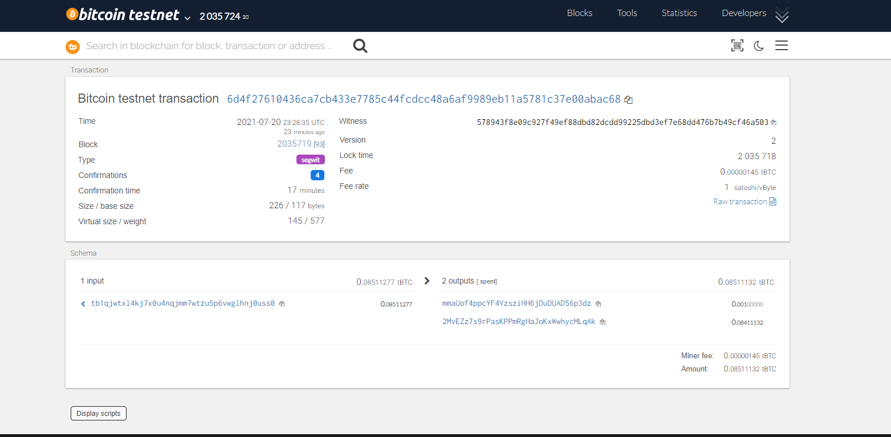
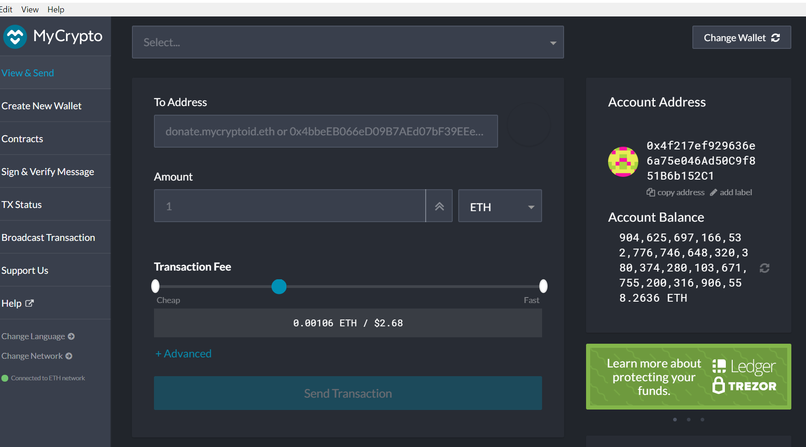
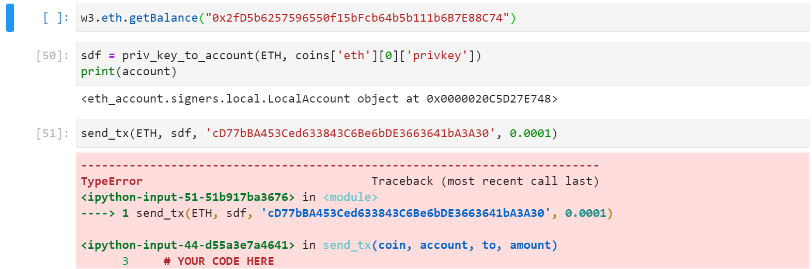
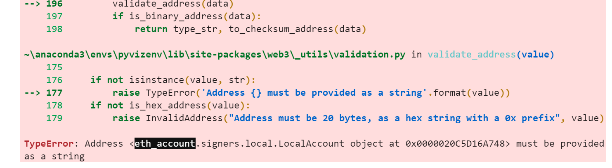

# Multi-Blockchain Wallet in Python

## Background

Your new startup is focusing on building a portfolio management system that supports not only traditional assets
like gold, silver, stocks, etc, but crypto-assets as well! The problem is, there are so many coins out there! It's
a good thing you understand how HD wallets work, since you'll need to build out a system that can create them.

You're in a race to get to the market. There aren't as many tools available in Python for this sort of thing, yet.
Thankfully, you've found a command line tool, `hd-wallet-derive` that supports not only BIP32, BIP39, and BIP44, but
also supports non-standard derivation paths for the most popular wallets out there today! However, you need to integrate
the script into your backend with your dear old friend, Python.

Once you've integrated this "universal" wallet, you can begin to manage billions of addresses across 300+ coins, giving
you a serious edge against the competition.

In this assignment, however, you will only need to get 2 coins working: Ethereum and Bitcoin Testnet.
Ethereum keys are the same format on any network, so the Ethereum keys should work with your custom networks or testnets.


### 6. Send some transactions!

- Now, you should be able to fund these wallets using testnet faucets. 
- Open up a new terminal window inside of `wallet`.
- Then run the command `python` to open the Python shell. 
- Within the Python shell, run the command `from wallet import *`. This will allow you to access the functions in `wallet.py` interactively.
- You'll need to set the account with  `priv_key_to_account` and use `send_tx` to send transactions.

  - **Bitcoin Testnet transaction**

    - Fund a `BTCTEST` address using [this testnet faucet](https://testnet-faucet.mempool.co/).

    - Use a [block explorer](https://tbtc.bitaps.com/) to watch transactions on the address.

    - Send a transaction to another testnet address (either one of your own, or the faucet's).

    - Screenshot the confirmation of the transaction like so:

<p align="middle">
  
</p>

<p align="middle">
  
</p>


This was my screenshot for my Bitcoin Testnet Transaction

  - **Local PoA Ethereum transaction**

    - Add one of the `ETH` addresses to the pre-allocated accounts in your `networkname.json`.

    - Delete the `geth` folder in each node, then re-initialize using `geth --datadir nodeX init networkname.json`.
      This will create a new chain, and will pre-fund the new account.

    - [Add the following middleware](https://web3py.readthedocs.io/en/stable/middleware.html#geth-style-proof-of-authority)
      to `web3.py` to support the PoA algorithm:

      ```
      from web3.middleware import geth_poa_middleware

      w3.middleware_onion.inject(geth_poa_middleware, layer=0)
      ```

    - Due to a bug in `web3.py`, you will need to send a transaction or two with MyCrypto first, since the
      `w3.eth.generateGasPrice()` function does not work with an empty chain. You can use one of the `ETH` address `privkey`,
      or one of the `node` keystore files.

    - Send a transaction from the pre-funded address within the wallet to another, then copy the `txid` into
      MyCrypto's TX Status, and screenshot the successful transaction like so:

For the Ethereum Tranaction I was not able to get to the traaction since there was some error in the code. Below is my attempt and the error I got.

<p align="middle">
  
</p>
This is MyCrypto wallet 

<p align="middle">
  
</p>
This is my code for the ethereum
<p align="middle">
  
</p>
